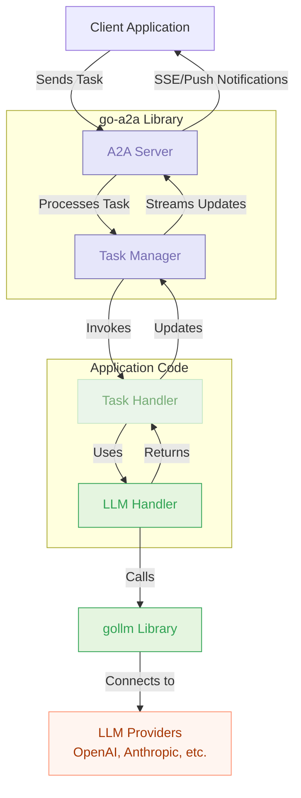

# go-a2a: Agent-to-Agent Protocol Implementation in Go

[](https://pkg.go.dev/github.com/sammcj/go-a2a)

A Go implementation of the Agent-to-Agent (A2A) protocol, enabling Go applications to act as A2A agents or interact with them.

## Overview

The Agent-to-Agent (A2A) protocol is designed to facilitate communication between AI agents. This library provides both server and client implementations of the protocol in Go, allowing developers to:

- Create A2A agents that can receive and process tasks
- Build client applications that can interact with A2A agents
- Implement authentication and push notification mechanisms
- Handle streaming task updates via Server-Sent Events (SSE)

## Architecture

The library is structured into several key components:

### Core Types (`a2a` package)

Contains the fundamental data structures defined by the A2A protocol:

- `AgentCard`: Describes an agent's capabilities, skills, and authentication requirements
- `Task`: Represents a task being processed by an agent
- `Message`: Represents a message within a task's history
- `Part`: Interface for different types of content (text, files, data)
- Error types that map to JSON-RPC error codes

### Server (`server` package)

Implements the server-side of the A2A protocol:

- `Server`: Main server implementation that handles HTTP requests
- `TaskManager`: Interface for managing task state and processing
- `InMemoryTaskManager`: Default implementation that stores tasks in memory
- SSE handling for streaming task updates
- Push notification support for task status and artifact updates
- Authentication middleware

### Client (`client` package)

Implements the client-side of the A2A protocol:

- `Client`: Main client implementation for interacting with A2A servers
- Methods for sending tasks, getting task status, cancelling tasks, etc.
- SSE client for receiving streaming task updates
- Authentication configuration

## Getting Started

### Installation

```bash
go get github.com/sammcj/go-a2a
```

### Creating an A2A Server

Here's a simple example of creating an A2A server:

```go
package main

import (
	"context"
	"fmt"
	"log"
	"time"

	"github.com/sammcj/go-a2a/a2a"
	"github.com/sammcj/go-a2a/server"
)

func main() {
	// Create a task handler function
	taskHandler := func(ctx context.Context, taskCtx server.TaskContext) (<-chan server.TaskYieldUpdate, error) {
		updateChan := make(chan server.TaskYieldUpdate)

		go func() {
			defer close(updateChan)

			// Get the user's message
			userMessage := taskCtx.UserMessage
			var userText string
			for _, part := range userMessage.Parts {
				if textPart, ok := part.(a2a.TextPart); ok {
					userText = textPart.Text
					break
				}
			}

			// Create a response message
			responseMessage := a2a.Message{
				Role:      a2a.RoleAgent,
				Timestamp: time.Now(),
				Parts: []a2a.Part{
					a2a.TextPart{
						Type: "text",
						Text: fmt.Sprintf("Echo: %s", userText),
					},
				},
			}

			// Send a working status update
			updateChan <- server.StatusUpdate{
				State:   a2a.TaskStateWorking,
				Message: &responseMessage,
			}

			// Send a completed status update
			updateChan <- server.StatusUpdate{
				State: a2a.TaskStateCompleted,
			}
		}()

		return updateChan, nil
	}

	// Create an agent card
	agentCard := &a2a.AgentCard{
		A2AVersion: "1.0",
		ID:         "echo-agent",
		Name:       "Echo Agent",
		Description: func() *string {
			s := "An agent that echoes back your messages"
			return &s
		}(),
		Skills: []a2a.AgentSkill{
			{
				ID:   "echo",
				Name: "Echo",
			},
		},
		Capabilities: &a2a.AgentCapabilities{
			SupportsStreaming: true,
		},
	}

	// Create and start the server
	a2aServer, err := server.NewServer(
		server.WithAgentCard(agentCard),
		server.WithTaskHandler(taskHandler),
		server.WithListenAddress(":8080"),
	)
	if err != nil {
		log.Fatalf("Failed to create A2A server: %v", err)
	}

	// Start the server
	if err := a2aServer.Start(); err != nil {
		log.Fatalf("Failed to start A2A server: %v", err)
	}
}
```

### Using the A2A Client

Here's how to use the client to interact with an A2A server:

```go
package main

import (
	"context"
	"fmt"
	"log"
	"time"

	"github.com/sammcj/go-a2a/a2a"
	"github.com/sammcj/go-a2a/client"
)

func main() {
	// Create a client
	a2aClient, err := client.NewClient(
		client.WithBaseURL("http://localhost:8080"),
	)
	if err != nil {
		log.Fatalf("Failed to create A2A client: %v", err)
	}

	// Create a message
	message := a2a.Message{
		Role:      a2a.RoleUser,
		Timestamp: time.Now(),
		Parts: []a2a.Part{
			a2a.TextPart{
				Type: "text",
				Text: "Hello, world!",
			},
		},
	}

	// Send a task
	task, err := a2aClient.SendTask(context.Background(), &a2a.TaskSendParams{
		Message: message,
	})
	if err != nil {
		log.Fatalf("Failed to send task: %v", err)
	}

	fmt.Printf("Task created with ID: %s\n", task.ID)
	fmt.Printf("Task status: %s\n", task.Status.State)

	// Get task updates via streaming
	updateChan, errChan := a2aClient.SendSubscribe(context.Background(), &a2a.TaskSendParams{
		Message: message,
	})

	// Process updates
	for {
		select {
		case update, ok := <-updateChan:
			if !ok {
				// Channel closed, all updates received
				return
			}
			if update.Type == "status" {
				fmt.Printf("Status update: %s\n", update.Status.State)
			} else if update.Type == "artifact" {
				fmt.Printf("Artifact update: %s\n", update.Artifact.ID)
			}
		case err := <-errChan:
			log.Fatalf("Error receiving updates: %v", err)
		}
	}
}
```

## Authentication

The library supports various authentication methods as defined in the A2A protocol:

### Server-side Authentication

```go
// Create an authentication validator
authValidator := func(w http.ResponseWriter, r *http.Request, next http.Handler, card *a2a.AgentCard) {
	// Get the Authorization header
	authHeader := r.Header.Get("Authorization")
	if authHeader == "" {
		http.Error(w, "Authentication required", http.StatusUnauthorized)
		return
	}

	// Check if it's a Bearer token
	if len(authHeader) < 7 || authHeader[:7] != "Bearer " {
		http.Error(w, "Invalid authentication format", http.StatusUnauthorized)
		return
	}

	// Get the token
	token := authHeader[7:]

	// Check if it's the expected token
	if token != "secret-token" {
		http.Error(w, "Invalid token", http.StatusUnauthorized)
		return
	}

	// Token is valid, proceed to the next handler
	next.ServeHTTP(w, r)
}

// Add authentication to the server
a2aServer, err := server.NewServer(
	server.WithAgentCard(agentCard),
	server.WithTaskHandler(taskHandler),
	server.WithAuthValidator(authValidator),
)
```

### Client-side Authentication

```go
// Create a client with authentication
a2aClient, err := client.NewClient(
	client.WithBaseURL("http://localhost:8080"),
	client.WithBearerToken("secret-token"),
)
```

## Push Notifications

The library supports push notifications for task updates:

### Setting Up Push Notifications (Client)

```go
// Set up push notifications for a task
config, err := a2aClient.SetTaskPushNotification(context.Background(), &a2a.TaskPushNotificationConfigParams{
	TaskID:           task.ID,
	URL:              "https://your-server.com/push-notifications",
	IncludeTaskData:  &includeTaskData,   // true/false
	IncludeArtifacts: &includeArtifacts,  // true/false
	Authentication: &a2a.AuthenticationInfo{
		Type: "bearer",
		Configuration: map[string]interface{}{
			"token": "your-push-notification-token",
		},
	},
})
```

### Receiving Push Notifications (Server)

```go
// Set up an HTTP handler to receive push notifications
http.HandleFunc("/push-notifications", func(w http.ResponseWriter, r *http.Request) {
	// Parse the request body
	var payload map[string]interface{}
	if err := json.NewDecoder(r.Body).Decode(&payload); err != nil {
		http.Error(w, "Bad request", http.StatusBadRequest)
		return
	}

	// Process the notification
	fmt.Printf("Received push notification: %+v\n", payload)

	// Return a success response
	w.WriteHeader(http.StatusOK)
})
```

## Server-Sent Events (SSE)

The library supports SSE for streaming task updates:

### Streaming Task Updates (Server)

The server automatically handles SSE connections for the `tasks/sendSubscribe` and `tasks/resubscribe` methods.

### Receiving Streaming Updates (Client)

```go
// Subscribe to task updates
updateChan, errChan := a2aClient.SendSubscribe(context.Background(), &a2a.TaskSendParams{
	Message: message,
})

// Process updates
for {
	select {
	case update, ok := <-updateChan:
		if !ok {
			// Channel closed, all updates received
			return
		}
		if update.Type == "status" {
			fmt.Printf("Status update: %s\n", update.Status.State)
		} else if update.Type == "artifact" {
			fmt.Printf("Artifact update: %s\n", update.Artifact.ID)
		}
	case err := <-errChan:
		log.Fatalf("Error receiving updates: %v", err)
	}
}
```

## Examples

See the `examples` directory for more detailed examples:

- `examples/simple_server.go`: A basic A2A server implementation
- `examples/simple_client.go`: A basic A2A client implementation
- `examples/auth_and_push_example.go`: An example demonstrating authentication and push notifications

## LLM Integration

The go-a2a library can be integrated with Large Language Models (LLMs) to create intelligent agents that can understand and respond to natural language requests. We use [gollm](https://github.com/teilomillet/gollm) for LLM integration, which provides a unified API for interacting with various LLM providers.

### Architecture



### Implementation

To integrate LLMs with your A2A agent, you can create an LLM handler that uses gollm to process tasks:

```go
package main

import (
	"context"
	"fmt"
	"os"

	"github.com/sammcj/go-a2a/a2a"
	"github.com/sammcj/go-a2a/server"
	"github.com/teilomillet/gollm"
)

// LLMHandler handles LLM interactions for the A2A agent
type LLMHandler struct {
	llm *gollm.LLM
}

// NewLLMHandler creates a new LLM handler
func NewLLMHandler() (*LLMHandler, error) {
	// Initialize gollm with your preferred provider and model
	llm, err := gollm.NewLLM(
		gollm.SetProvider("openai"),
		gollm.SetModel("gpt-4o"),
		gollm.SetAPIKey(os.Getenv("OPENAI_API_KEY")),
		gollm.SetMaxTokens(1000),
		gollm.SetMemory(4096), // Enable memory to maintain context
	)
	if err != nil {
		return nil, fmt.Errorf("failed to create LLM: %w", err)
	}

	return &LLMHandler{llm: llm}, nil
}

// ProcessMessage processes a user message and returns a response
func (h *LLMHandler) ProcessMessage(ctx context.Context, message string) (string, error) {
	// Create a prompt with the user's message
	prompt := gollm.NewPrompt(message,
		gollm.WithDirectives(
			"You are a helpful assistant",
			"Provide clear and concise responses",
		),
	)

	// Generate a response
	response, err := h.llm.Generate(ctx, prompt)
	if err != nil {
		return "", fmt.Errorf("failed to generate response: %w", err)
	}

	return response, nil
}

// Main task handler for the A2A server
func taskHandler(ctx context.Context, taskCtx server.TaskContext) (<-chan server.TaskYieldUpdate, error) {
	updateChan := make(chan server.TaskYieldUpdate)

	// Create an LLM handler
	llmHandler, err := NewLLMHandler()
	if err != nil {
		return nil, fmt.Errorf("failed to create LLM handler: %w", err)
	}

	go func() {
		defer close(updateChan)

		// Extract the user's message
		userMessage := taskCtx.UserMessage
		var userText string
		for _, part := range userMessage.Parts {
			if textPart, ok := part.(a2a.TextPart); ok {
				userText = textPart.Text
				break
			}
		}

		// Process the message with the LLM
		responseText, err := llmHandler.ProcessMessage(ctx, userText)
		if err != nil {
			// Send a failed status update
			updateChan <- server.StatusUpdate{
				State: a2a.TaskStateFailed,
				Message: &a2a.Message{
					Role:      a2a.RoleSystem,
					Timestamp: time.Now(),
					Parts: []a2a.Part{
						a2a.TextPart{
							Type: "text",
							Text: fmt.Sprintf("Failed to process message: %v", err),
						},
					},
				},
			}
			return
		}

		// Create a response message
		responseMessage := a2a.Message{
			Role:      a2a.RoleAgent,
			Timestamp: time.Now(),
			Parts: []a2a.Part{
				a2a.TextPart{
					Type: "text",
					Text: responseText,
				},
			},
		}

		// Send a working status update with the response
		updateChan <- server.StatusUpdate{
			State:   a2a.TaskStateWorking,
			Message: &responseMessage,
		}

		// Send a completed status update
		updateChan <- server.StatusUpdate{
			State: a2a.TaskStateCompleted,
		}
	}()

	return updateChan, nil
}
```

### Advanced LLM Features

The gollm library provides several advanced features that can be used to enhance your A2A agents:

1. **Chain of Thought Reasoning**: Use the `ChainOfThought` function for complex reasoning tasks.

2. **Structured Output**: Ensure your LLM outputs are in a valid format using JSON schema validation.

3. **Prompt Templates**: Create reusable prompt templates for consistent prompt generation.

4. **Model Comparison**: Compare responses from different LLM providers or models to find the best one for your task.

5. **Memory Retention**: Maintain context across multiple interactions for more coherent conversations.

### Example: Structured Task Processing

Here's an example of how to process tasks with structured outputs:

```go
func processStructuredTask(ctx context.Context, llmHandler *LLMHandler, task string) (map[string]interface{}, error) {
	// Create a prompt for structured output
	prompt := gollm.NewPrompt(task,
		gollm.WithDirectives(
			"Process this task and provide a structured response",
			"Be thorough and accurate",
		),
		gollm.WithOutput("Respond in JSON format with 'result', 'confidence', and 'reasoning' fields."),
	)

	// Generate a response with JSON validation
	response, err := llmHandler.llm.Generate(ctx, prompt, gollm.WithJSONSchemaValidation())
	if err != nil {
		return nil, fmt.Errorf("failed to generate structured response: %w", err)
	}

	// Parse the JSON response
	var result map[string]interface{}
	if err := json.Unmarshal([]byte(response), &result); err != nil {
		return nil, fmt.Errorf("failed to parse response: %w", err)
	}

	return result, nil
}
```

## Development Status

The library is currently in active development. The following features have been implemented:

- ✅ Core A2A types and constants
- ✅ Basic HTTP server with JSON-RPC request/response handling
- ✅ In-memory task management
- ✅ Agent card serving
- ✅ Basic client methods (SendTask, GetTask, CancelTask)
- ✅ SSE support for streaming task updates
- ✅ Authentication middleware
- ✅ Push notification support

Future enhancements may include:

- More comprehensive examples
- Improved documentation
- Additional helper utilities
- Integration with other libraries and frameworks
- Enhanced LLM integration with specialized agent templates

## License

This project is licensed under the MIT License - see the LICENSE file for details.
