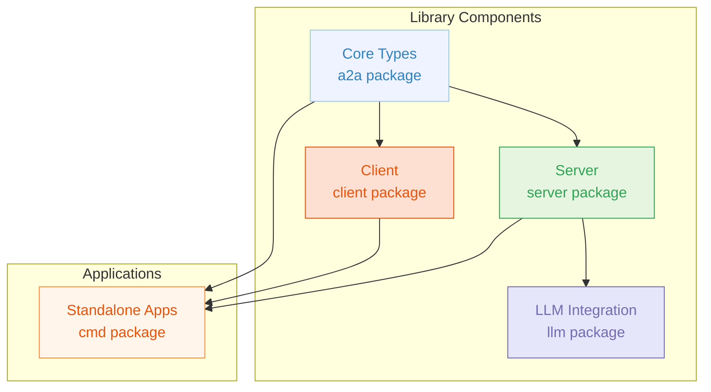
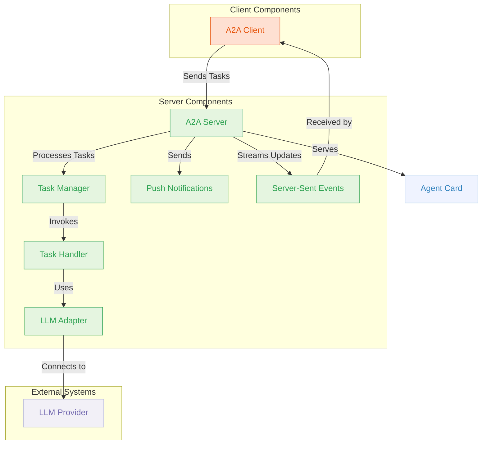
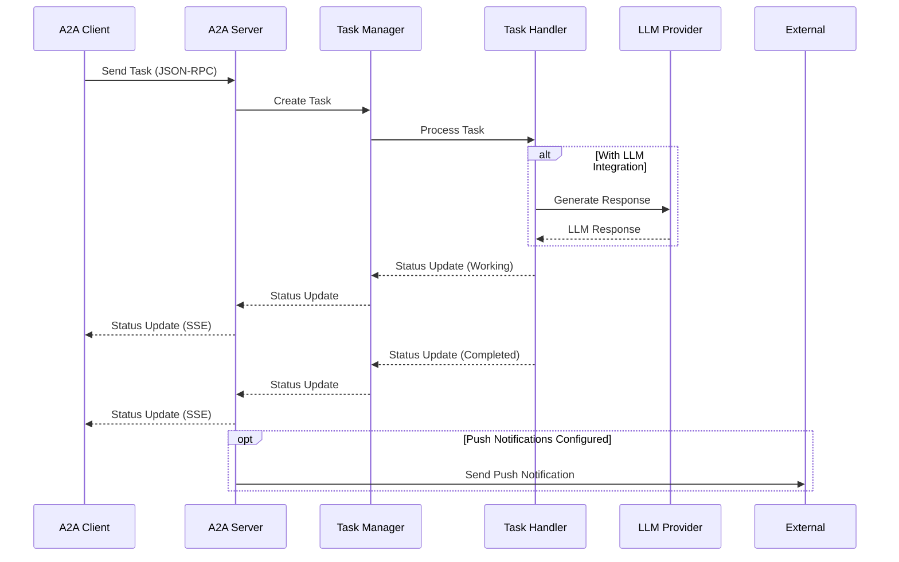
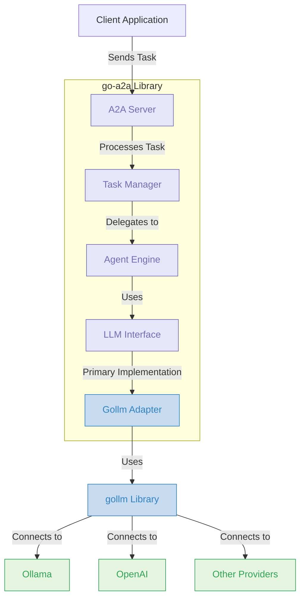
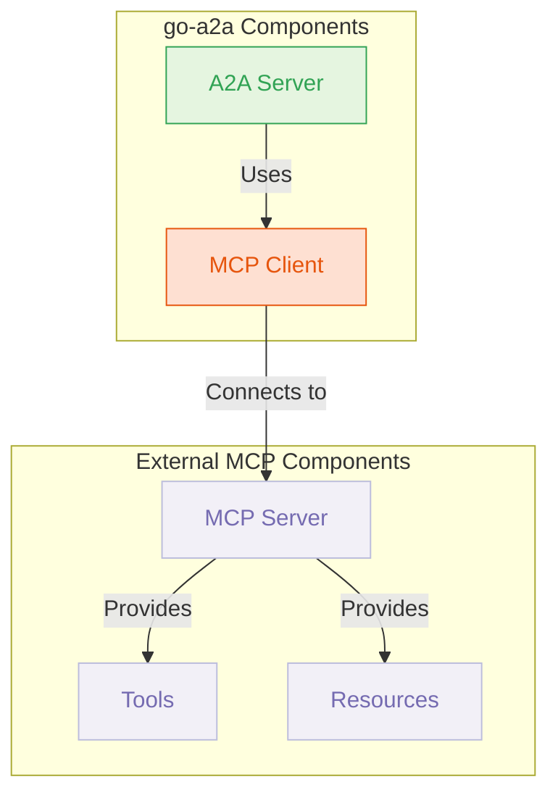

# go-a2a: Agent-to-Agent Protocol Implementation in Go

**DRAFT / EARLY ALPHA - DO NOT USE IN PRODUCTION**

[](https://pkg.go.dev/github.com/sammcj/go-a2a)

A comprehensive Go implementation of the Agent-to-Agent (A2A) protocol, enabling seamless communication between AI agents through a standardized interface.

## What is go-a2a?

**go-a2a** is a complete toolkit for building and connecting AI agents using the Agent-to-Agent (A2A) protocol in Go. It provides:

- **A2A Server**: Create agents that can receive, process, and respond to tasks
- **A2A Client**: Build applications that can communicate with A2A-compatible agents
- **Standalone Applications**: Use the included command-line tools without writing code
- **LLM Integration**: Connect to language models like OpenAI GPT or local Ollama models
- **MCP Integration**: Leverage Model Context Protocol (MCP) tools and resources

Whether you're building a simple echo agent, a complex AI assistant, or integrating with existing agent ecosystems, go-a2a provides the building blocks you need.

## Key Features

- **Full A2A Protocol Support**: Implements the complete A2A specification
- **Flexible Architecture**: Modular design with clean interfaces for customization
- **Streaming Updates**: Real-time task updates via Server-Sent Events (SSE)
- **Authentication**: Built-in support for various authentication methods
- **Push Notifications**: Configurable webhooks for task status updates
- **LLM Integration**: Direct connection to language models via gollm
- **Standalone Tools**: Command-line applications for server and client operations
- **Docker Support**: Ready-to-use Docker images and docker-compose configuration

## System Architecture

The go-a2a library is structured into several interconnected components:



### Component Relationships



### Data Flow



## Use Case Scenarios

### Scenario 1: AI Assistant with Local LLM

**Components Used:**
- A2A Server with LLM Integration
- A2A Client (CLI or custom application)
- Ollama for local LLM inference

**Description:**
Deploy an AI assistant that runs entirely on your local machine. The A2A server connects to Ollama to process natural language requests, while clients can interact with it through a command-line interface or custom application. This setup provides privacy and control over the AI assistant, as all processing happens locally.

**Example Flow:**
1. Start the A2A server with Ollama integration
2. Connect to the server using the A2A client
3. Send natural language requests to the assistant
4. Receive responses generated by the local LLM

### Scenario 2: Enterprise Agent Network

**Components Used:**
- Multiple A2A Servers with different specializations
- A2A Client for orchestration
- Push Notifications for asynchronous workflows
- Authentication for secure access

**Description:**
Create a network of specialized agents within an enterprise environment. Each agent handles specific tasks (data analysis, content generation, customer support, etc.) and can communicate with other agents. A central orchestration client coordinates workflows across agents, with push notifications enabling asynchronous processing for long-running tasks.

**Example Flow:**
1. User submits a request to the orchestration client
2. Client determines which specialized agents are needed
3. Tasks are distributed to appropriate agents
4. Agents process tasks and may delegate subtasks to other agents
5. Results are collected and presented to the user
6. Push notifications keep stakeholders informed of progress

### Scenario 3: Tool-Augmented Research Assistant

**Components Used:**
- A2A Server with LLM Integration
- Tool-Augmented Agent
- MCP Integration for external tools
- Streaming updates for real-time interaction

**Description:**
Build a research assistant that combines LLM capabilities with specialized tools. The agent can search the web, access databases, analyze data, and generate visualizations to assist with research tasks. Streaming updates provide real-time feedback during complex operations.

**Example Flow:**
1. Researcher submits a query to the assistant
2. LLM analyzes the query and determines required tools
3. Agent executes searches using MCP-connected tools
4. Data is processed and analyzed
5. Results are synthesized into a coherent response
6. Streaming updates show progress throughout the process

### Scenario 4: Customer Support System

**Components Used:**
- A2A Server with authentication
- Multiple client interfaces (web, mobile, chat)
- Push notifications for status updates
- LLM integration for natural language understanding

**Description:**
Deploy a customer support system that handles inquiries across multiple channels. The A2A server processes requests using LLM capabilities to understand customer needs, while push notifications keep customers informed about their support tickets. Authentication ensures that only authorized users can access sensitive information.

**Example Flow:**
1. Customer submits a support request through a client interface
2. Request is authenticated and sent to the A2A server
3. LLM analyzes the request and generates an initial response
4. For complex issues, the request is escalated to human support
5. Push notifications update the customer on ticket status
6. Resolution is delivered back to the customer's preferred channel

## Architecture

The library is structured into several key components:

### Core Types (`a2a` package)

Contains the fundamental data structures defined by the A2A protocol:

- `AgentCard`: Describes an agent's capabilities, skills, and authentication requirements
- `Task`: Represents a task being processed by an agent
- `Message`: Represents a message within a task's history
- `Part`: Interface for different types of content (text, files, data)
- Error types that map to JSON-RPC error codes

### Server (`server` package)

Implements the server-side of the A2A protocol:

- `Server`: Main server implementation that handles HTTP requests
- `TaskManager`: Interface for managing task state and processing
- `InMemoryTaskManager`: Default implementation that stores tasks in memory
- SSE handling for streaming task updates
- Push notification support for task status and artifact updates
- Authentication middleware

### Client (`client` package)

Implements the client-side of the A2A protocol:

- `Client`: Main client implementation for interacting with A2A servers
- Methods for sending tasks, getting task status, cancelling tasks, etc.
- SSE client for receiving streaming task updates
- Authentication configuration

## Getting Started

### Installation

```bash
go get github.com/sammcj/go-a2a
```

### Creating an A2A Server

Here's a simple example of creating an A2A server:

```go
package main

import (
	"context"
	"fmt"
	"log"
	"time"

	"github.com/sammcj/go-a2a/a2a"
	"github.com/sammcj/go-a2a/server"
)

func main() {
	// Create a task handler function
	taskHandler := func(ctx context.Context, taskCtx server.TaskContext) (<-chan server.TaskYieldUpdate, error) {
		updateChan := make(chan server.TaskYieldUpdate)

		go func() {
			defer close(updateChan)

			// Get the user's message
			userMessage := taskCtx.UserMessage
			var userText string
			for _, part := range userMessage.Parts {
				if textPart, ok := part.(a2a.TextPart); ok {
					userText = textPart.Text
					break
				}
			}

			// Create a response message
			responseMessage := a2a.Message{
				Role:      a2a.RoleAgent,
				Timestamp: time.Now(),
				Parts: []a2a.Part{
					a2a.TextPart{
						Type: "text",
						Text: fmt.Sprintf("Echo: %s", userText),
					},
				},
			}

			// Send a working status update
			updateChan <- server.StatusUpdate{
				State:   a2a.TaskStateWorking,
				Message: &responseMessage,
			}

			// Send a completed status update
			updateChan <- server.StatusUpdate{
				State: a2a.TaskStateCompleted,
			}
		}()

		return updateChan, nil
	}

	// Create an agent card
	agentCard := &a2a.AgentCard{
		A2AVersion: "1.0",
		ID:         "echo-agent",
		Name:       "Echo Agent",
		Description: func() *string {
			s := "An agent that echoes back your messages"
			return &s
		}(),
		Skills: []a2a.AgentSkill{
			{
				ID:   "echo",
				Name: "Echo",
			},
		},
		Capabilities: &a2a.AgentCapabilities{
			SupportsStreaming: true,
		},
	}

	// Create and start the server
	a2aServer, err := server.NewServer(
		server.WithAgentCard(agentCard),
		server.WithTaskHandler(taskHandler),
		server.WithListenAddress(":8080"),
	)
	if err != nil {
		log.Fatalf("Failed to create A2A server: %v", err)
	}

	// Start the server
	if err := a2aServer.Start(); err != nil {
		log.Fatalf("Failed to start A2A server: %v", err)
	}
}
```

### Using the A2A Client

Here's how to use the client to interact with an A2A server:

```go
package main

import (
	"context"
	"fmt"
	"log"
	"time"

	"github.com/sammcj/go-a2a/a2a"
	"github.com/sammcj/go-a2a/client"
)

func main() {
	// Create a client
	a2aClient, err := client.NewClient(
		client.WithBaseURL("http://localhost:8080"),
	)
	if err != nil {
		log.Fatalf("Failed to create A2A client: %v", err)
	}

	// Create a message
	message := a2a.Message{
		Role:      a2a.RoleUser,
		Timestamp: time.Now(),
		Parts: []a2a.Part{
			a2a.TextPart{
				Type: "text",
				Text: "Hello, world!",
			},
		},
	}

	// Send a task
	task, err := a2aClient.SendTask(context.Background(), &a2a.TaskSendParams{
		Message: message,
	})
	if err != nil {
		log.Fatalf("Failed to send task: %v", err)
	}

	fmt.Printf("Task created with ID: %s\n", task.ID)
	fmt.Printf("Task status: %s\n", task.Status.State)

	// Get task updates via streaming
	updateChan, errChan := a2aClient.SendSubscribe(context.Background(), &a2a.TaskSendParams{
		Message: message,
	})

	// Process updates
	for {
		select {
		case update, ok := <-updateChan:
			if !ok {
				// Channel closed, all updates received
				return
			}
			if update.Type == "status" {
				fmt.Printf("Status update: %s\n", update.Status.State)
			} else if update.Type == "artifact" {
				fmt.Printf("Artifact update: %s\n", update.Artifact.ID)
			}
		case err := <-errChan:
			log.Fatalf("Error receiving updates: %v", err)
		}
	}
}
```

## Authentication

The library supports various authentication methods as defined in the A2A protocol:

### Server-side Authentication

```go
// Create an authentication validator
authValidator := func(w http.ResponseWriter, r *http.Request, next http.Handler, card *a2a.AgentCard) {
	// Get the Authorization header
	authHeader := r.Header.Get("Authorization")
	if authHeader == "" {
		http.Error(w, "Authentication required", http.StatusUnauthorized)
		return
	}

	// Check if it's a Bearer token
	if len(authHeader) < 7 || authHeader[:7] != "Bearer " {
		http.Error(w, "Invalid authentication format", http.StatusUnauthorized)
		return
	}

	// Get the token
	token := authHeader[7:]

	// Check if it's the expected token
	if token != "secret-token" {
		http.Error(w, "Invalid token", http.StatusUnauthorized)
		return
	}

	// Token is valid, proceed to the next handler
	next.ServeHTTP(w, r)
}

// Add authentication to the server
a2aServer, err := server.NewServer(
	server.WithAgentCard(agentCard),
	server.WithTaskHandler(taskHandler),
	server.WithAuthValidator(authValidator),
)
```

### Client-side Authentication

```go
// Create a client with authentication
a2aClient, err := client.NewClient(
	client.WithBaseURL("http://localhost:8080"),
	client.WithBearerToken("secret-token"),
)
```

## Push Notifications

The library supports push notifications for task updates:

### Setting Up Push Notifications (Client)

```go
// Set up push notifications for a task
config, err := a2aClient.SetTaskPushNotification(context.Background(), &a2a.TaskPushNotificationConfigParams{
	TaskID:           task.ID,
	URL:              "https://your-server.com/push-notifications",
	IncludeTaskData:  &includeTaskData,   // true/false
	IncludeArtifacts: &includeArtifacts,  // true/false
	Authentication: &a2a.AuthenticationInfo{
		Type: "bearer",
		Configuration: map[string]interface{}{
			"token": "your-push-notification-token",
		},
	},
})
```

### Receiving Push Notifications (Server)

```go
// Set up an HTTP handler to receive push notifications
http.HandleFunc("/push-notifications", func(w http.ResponseWriter, r *http.Request) {
	// Parse the request body
	var payload map[string]interface{}
	if err := json.NewDecoder(r.Body).Decode(&payload); err != nil {
		http.Error(w, "Bad request", http.StatusBadRequest)
		return
	}

	// Process the notification
	fmt.Printf("Received push notification: %+v\n", payload)

	// Return a success response
	w.WriteHeader(http.StatusOK)
})
```

## Server-Sent Events (SSE)

The library supports SSE for streaming task updates:

### Streaming Task Updates (Server)

The server automatically handles SSE connections for the `tasks/sendSubscribe` and `tasks/resubscribe` methods.

### Receiving Streaming Updates (Client)

```go
// Subscribe to task updates
updateChan, errChan := a2aClient.SendSubscribe(context.Background(), &a2a.TaskSendParams{
	Message: message,
})

// Process updates
for {
	select {
	case update, ok := <-updateChan:
		if !ok {
			// Channel closed, all updates received
			return
		}
		if update.Type == "status" {
			fmt.Printf("Status update: %s\n", update.Status.State)
		} else if update.Type == "artifact" {
			fmt.Printf("Artifact update: %s\n", update.Artifact.ID)
		}
	case err := <-errChan:
		log.Fatalf("Error receiving updates: %v", err)
	}
}
```

## Examples

See the `examples` directory for more detailed examples:

- `examples/simple_server.go`: A basic A2A server implementation
- `examples/simple_client.go`: A basic A2A client implementation
- `examples/auth_and_push_example.go`: An example demonstrating authentication and push notifications

## LLM Integration

The go-a2a library includes built-in support for Large Language Models (LLMs) to create intelligent agents that can understand and respond to natural language requests. The library provides a flexible, modular architecture for LLM integration with a focus on the [gollm](https://github.com/teilomillet/gollm) library as the primary adapter.

### Architecture



### Key Components

1. **LLM Interface**: A standard interface for interacting with LLMs
2. **Agent Engine**: Processes tasks using LLMs and optional tools
3. **gollm Adapter**: Primary implementation of the LLM interface using gollm

### Implementation

The go-a2a library provides built-in components for LLM integration:

```go
package main

import (
	"log"
	"os"

	"github.com/sammcj/go-a2a/a2a"
	"github.com/sammcj/go-a2a/server"
)

func main() {
	// Create an agent card
	agentCard := &a2a.AgentCard{
		A2AVersion: "1.0",
		ID:         "assistant-agent",
		Name:       "Assistant Agent",
		Description: func() *string {
			s := "An intelligent assistant powered by Ollama"
			return &s
		}(),
		Skills: []a2a.AgentSkill{
			{
				ID:   "general-assistance",
				Name: "General Assistance",
			},
		},
		Capabilities: &a2a.AgentCapabilities{
			SupportsStreaming: true,
		},
	}

	// Create and start the server with a gollm-based agent
	a2aServer, err := server.NewServer(
		server.WithAgentCard(agentCard),
		server.WithBasicGollmAgent(
			"ollama",                // provider
			"llama3",                // model
			"",                      // API key (not needed for Ollama)
			"You are a helpful assistant that responds to user queries.",
		),
		server.WithListenAddress(":8080"),
	)
	if err != nil {
		log.Fatalf("Failed to create A2A server: %v", err)
	}

	// Start the server
	if err := a2aServer.Start(); err != nil {
		log.Fatalf("Failed to start A2A server: %v", err)
	}
}
```

### Supported LLM Providers

The gollm adapter focuses on supporting:

1. **Ollama**: For local model deployment and inference
2. **OpenAI-compatible APIs**: For compatibility with various hosted services

### Advanced Features

The LLM integration supports several advanced features:

1. **Tool Augmentation**: Enhance your agents with tools like weather APIs, calculators, etc.

```go
// Create a server with a tool-augmented gollm agent
server.WithToolAugmentedGollmAgent(
    "openai",                 // provider
    "gpt-4o",                 // model
    os.Getenv("OPENAI_API_KEY"),
    []server.Tool{weatherTool, calculatorTool},
)
```

2. **Streaming Responses**: Support for streaming LLM responses for real-time updates

3. **Structured Output**: Ensure LLM outputs are in a valid format using JSON schema validation

4. **Memory Retention**: Maintain context across multiple interactions for more coherent conversations

```go
// Create a custom gollm adapter with memory
llmAdapter, err := gollm.NewAdapter(
    gollm.WithProvider("ollama"),
    gollm.WithModel("llama3"),
    gollm.WithMemory(4096), // Enable memory for context retention
)
```

5. **Custom Prompting**: Configure system prompts and directives for consistent agent behavior

## MCP Integration

The go-a2a library includes support for the Model Context Protocol (MCP), allowing A2A agents to leverage MCP tools and resources:



### Key Features

1. **Tool Access**: A2A agents can use MCP tools for specialized capabilities
2. **Resource Access**: A2A agents can access MCP resources for additional context
3. **Seamless Integration**: MCP functionality is integrated directly into the A2A task handling flow

## Standalone Applications

The library includes standalone server and client applications that can be used without writing any Go code:

### A2A Server

The A2A server is a standalone application that implements the A2A protocol. It can be used to host an A2A agent that can receive and process tasks from A2A clients.

```bash
# Build the server
go build -o a2a-server ./cmd/a2a-server

# Run the server
./a2a-server --config config/server.json
```

The server supports plugins for task handling. Plugins are Go plugins that implement the `TaskHandlerPlugin` interface.

### A2A Client

The A2A client is a standalone application that can be used to interact with A2A servers.

```bash
# Build the client
go build -o a2a-client ./cmd/a2a-client

# Get agent card
./a2a-client --url http://localhost:8080 card

# Send a task
./a2a-client --url http://localhost:8080 send --message "Hello, world!"
```

### Docker Support

Both applications can be run using Docker:

```bash
# Build the Docker image
docker build -t go-a2a .

# Run the server
docker run -p 8080:8080 -v ./config:/app/config -v ./plugins:/app/plugins go-a2a

# Run the client
docker run --entrypoint /app/bin/a2a-client go-a2a --url http://localhost:8080 card
```

A docker-compose.yml file is also provided for running the server and client together:

```bash
docker-compose up
```

For more information, see the [cmd/README.md](cmd/README.md) file.

## What go-a2a Is Not

While go-a2a provides a comprehensive implementation of the A2A protocol, it's important to understand its boundaries:

- **Not an AI Model**: go-a2a is not an AI model itself, but rather a framework for connecting to and utilizing AI models
- **Not a Complete Agent Solution**: While it provides the building blocks, you'll need to implement your own agent logic or connect to existing AI services
- **Not a Web Framework**: Although it includes HTTP functionality, it's focused specifically on the A2A protocol rather than general web development
- **Not a Database**: The default implementation uses in-memory storage; for production use with large volumes of tasks, you'll need to implement persistent storage

## Development Status

The library is currently in active development. The following features have been implemented:

- ✅ Core A2A types and constants
- ✅ Basic HTTP server with JSON-RPC request/response handling
- ✅ In-memory task management
- ✅ Agent card serving
- ✅ Basic client methods (SendTask, GetTask, CancelTask)
- ✅ SSE support for streaming task updates
- ✅ Authentication middleware
- ✅ Push notification support
- ✅ LLM integration with gollm
- ✅ MCP integration for tool access
- ✅ Standalone server and client applications
- ✅ Docker support

Future enhancements may include:

- More comprehensive examples
- Improved documentation
- Additional helper utilities
- Integration with other libraries and frameworks
- Enhanced LLM integration with specialized agent templates
- Persistent storage options
- Monitoring and metrics endpoints

## License

This project is licensed under the MIT License - see the LICENSE file for details.
