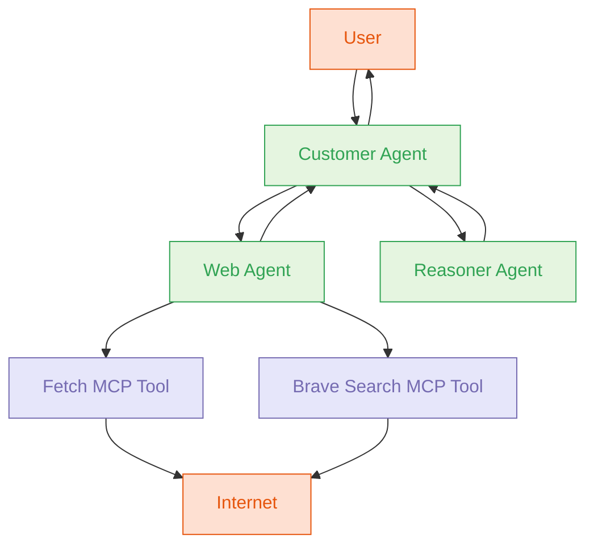

# Multi-Agent System with go-a2a

This project implements a multi-agent system using the go-a2a library. It consists of three agents:

1. **Web Agent**: Uses Ollama LLM with fetch and brave-search MCP tools to search the internet and retrieve web content.
2. **Customer Agent**: Uses Ollama LLM to handle user requests and coordinate with other agents.
3. **Reasoner Agent**: Uses an OpenAI-compatible API to perform complex reasoning and analysis on provided information.

## Agent Discovery and Communication

This system leverages the go-a2a package's core capabilities for agent discovery and communication:

### Agent Discovery

1. **Agent Cards**: Each agent has a defined `AgentCard` in its configuration that describes its capabilities, skills, and endpoints. These cards are served at the standard `/.well-known/agent.json` path, allowing other agents to discover their capabilities through the A2A protocol.
2. **Skill Advertisement**: Each agent advertises specific skills in its AgentCard:
   - Web Agent: "web-search" and "web-fetch" skills
   - Customer Agent: "request-handling" and "agent-coordination" skills
   - Reasoner Agent: "critical-analysis", "logical-reasoning", and "insight-generation" skills
3. **Capabilities Declaration**: Each agent declares its capabilities in the AgentCard, including support for streaming, sessions, and push notifications, making these features discoverable by other agents.

### Agent Communication

1. **A2A Protocol**: All inter-agent communication follows the A2A protocol, using JSON-RPC 2.0 over HTTP. The `TaskRouter` component routes tasks between agents using the client methods from the go-a2a package.
2. **Task-Based Interaction**: Agents communicate through tasks, where:
   - The Customer Agent creates tasks for the Web and Reasoner agents
   - Tasks include messages with specific parts (text in our implementation)
   - Responses are returned as task status updates
3. **Message Passing**: The system uses the A2A message structure for all communications.
4. **Task Status Updates**: Agents communicate their progress through task status updates.

### System Integration

1. **Unified Client/Server Architecture**: Each agent acts as both a server (receiving requests) and a client (sending requests to other agents), using the go-a2a client and server implementations.
2. **Standardised Endpoints**: All agents expose the standard A2A endpoints under the `/a2a` path prefix, making them interoperable with any A2A-compatible client.
3. **Dynamic Discovery**: The system can be extended with new agents that can be dynamically discovered through their agent cards without modifying existing agents.
4. **MCP Tool Integration**: The Web Agent demonstrates how A2A can be integrated with MCP tools, showing how the A2A protocol can leverage external capabilities through the Model Context Protocol.

## Architecture



## Prerequisites

- Go 1.18 or later
- Ollama installed and running locally
- OpenAI API key or any OpenAI-compatible API key (for the reasoner agent)
- MCP tools: fetch and brave-search

## Configuration

The system uses three configuration files:

1. `config/web-agent.json`: Configuration for the web agent
2. `config/customer-agent.json`: Configuration for the customer agent
3. `config/reasoner-agent.json`: Configuration for the reasoner agent

### Web Agent Configuration

The web agent is configured to use Ollama with the llama3 model and has access to the fetch and brave-search MCP tools.

### Customer Agent Configuration

The customer agent is configured to use Ollama with the mistral model. It routes requests to the appropriate agent based on the nature of the request.

### Reasoner Agent Configuration

The reasoner agent is configured to use an OpenAI-compatible API with the gpt-4o model. It performs complex reasoning and analysis on provided information. The API base URL can be configured to use any OpenAI-compatible API endpoint.

## How It Works

1. The user sends a request to the customer agent.
2. The customer agent analyses the request and determines which agent should handle it:
   - If the request requires web search or information retrieval, it routes the request to the web agent.
   - If the request requires complex reasoning or analysis, it routes the request to the reasoner agent.
   - If the request can be handled directly, the customer agent responds to the user.
3. The web agent uses the fetch and brave-search MCP tools to search the internet and retrieve web content.
4. The reasoner agent uses an OpenAI-compatible API to perform complex reasoning and analysis.
5. The customer agent receives the response from the appropriate agent and forwards it to the user.

## Environment Variables

The system uses the following environment variables for configuration:

```bash
# Required for the reasoner agent
export OPENAI_API_KEY=your-api-key
export OPENAI_BASE_URL=https://api.openai.com/v1  # Optional, defaults to OpenAI's API

# Required for the web agent's brave-search MCP tool
export BRAVE_API_KEY=your-brave-api-key
```

## Running the System

1. Set the required environment variables:

```bash
export OPENAI_API_KEY=your-api-key
export BRAVE_API_KEY=your-brave-api-key
```

2. Start Ollama and ensure it's running:

```bash
ollama serve
```

3. Pull the required models:

```bash
ollama pull llama3
ollama pull mistral
```

4. Start the multi-agent system:

```bash
cd multi-agent
go run .
```

5. The system will start all three agents and print their URLs:

```
Starting web agent on :8081
Starting customer agent on :8082
Starting reasoner agent on :8083
All agents started successfully
Web agent: http://localhost:8081
Customer agent: http://localhost:8082
Reasoner agent: http://localhost:8083
```

6. You can interact with the system by sending requests to the customer agent:

```bash
curl -X POST -H "Content-Type: application/json" -d '{
  "jsonrpc": "2.0",
  "method": "tasks/send",
  "params": {
    "message": {
      "role": "user",
      "parts": [
        {
          "type": "text",
          "text": "What is the latest news about artificial intelligence?"
        }
      ]
    }
  },
  "id": "1"
}' http://localhost:8082/a2a
```

## Extending the System

You can extend the system by:

1. Adding more MCP tools to the web agent
2. Adding more agents with different capabilities
3. Implementing more sophisticated routing logic in the customer agent
4. Adding authentication and authorisation
5. Implementing graceful shutdown
